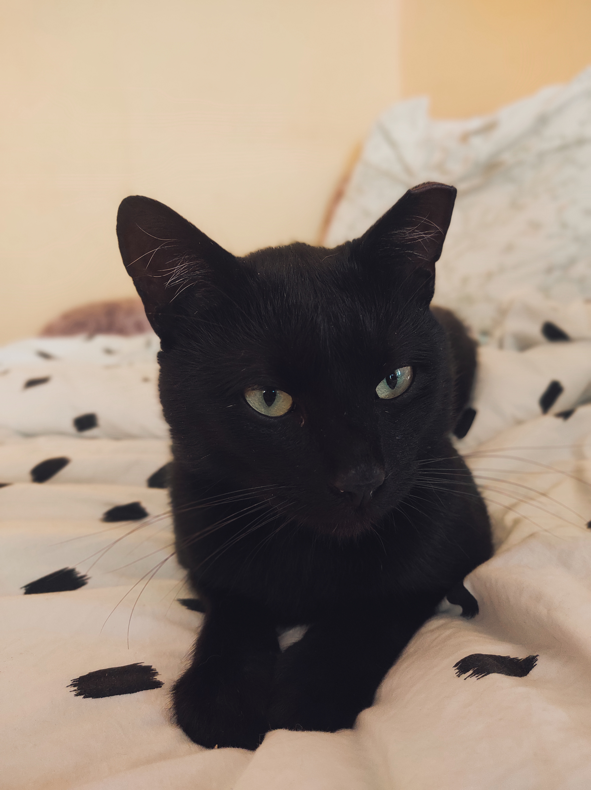

# **Otiss meklē mājas**
## Melnais briljants saimnieka meklējumos
Vien divus gadus vecais skaistulis tika atrasts Olaines pagalmos. Izbadējies un nobijies viņš tika noķerts ar Olaines dzīvnieku biedrības "Laimīgās astes" palīdzību un aizvests pie veterinārārsta. Klīnikā Otisu kastrēja un sniedza nepieciešamo medicīnisko aprūpi. Izrādās, ka Otim reiz bija saimniece, taču pārvācoties uz citu dzīvokli, sieviete abus savus mīluļus izlika uz ielas. Otiss ir nosaukts slavenā producenta Otisa Džeksona jeb Madlib vardā. Tagad Otiss atrodas pagaidu mājās, kur atkopjas no sūrās ielas dzīves, atgūst normālu svaru un ataudzē skaisto kažociņu.

Otim ļoti patīk:
- uzkāpt jo augstāk, jo labāk
- rotaļāties
- glausties klāt
- skatīties kopā ar saimnieku seriālus
- čučēt pie cilvēka sāna
- kārtīgi un garšīgi paēst
- iet cilvēkam pakaļ, lai kur tas arī vestu

Otiss ir diezgan neitrāls pret citiem savas sugas brāļiem. Neskatoties uz cilvēku nodevību - Otiks dievina cilvēku un ienīst putekļusūcējus un nadziņu apgriešanu. 

Vairāk Otika bildes var apskatīt šeit : https://www.facebook.com/groups/1490448714574063/posts/3271514073134176

Ja Jums ir pacietība, atbildība un bezgala daudz mīlestības, ko veltīt šim maigajam radījumam, tad sazinaties ar mani. Otiks tiks atdots tikai pēc mājdzīvnieka labturības līguma nosacījumiem.
Papildus nosacījumi topošajam saimniekam:

1. *Aizsargtīkli uz logiem.*
2. *Iespēja barot ar kvalitatīvu barību.*
3. *Negatīva nostāja pret pastaigām ārpusē bez saimnieka.*
4. *Iespējap nepieciešamības gadījumā aizvest mīluli pie vetārsta.*